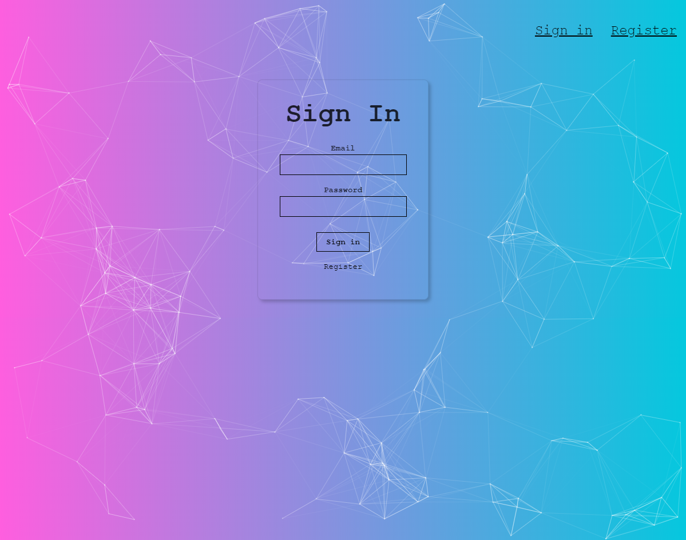
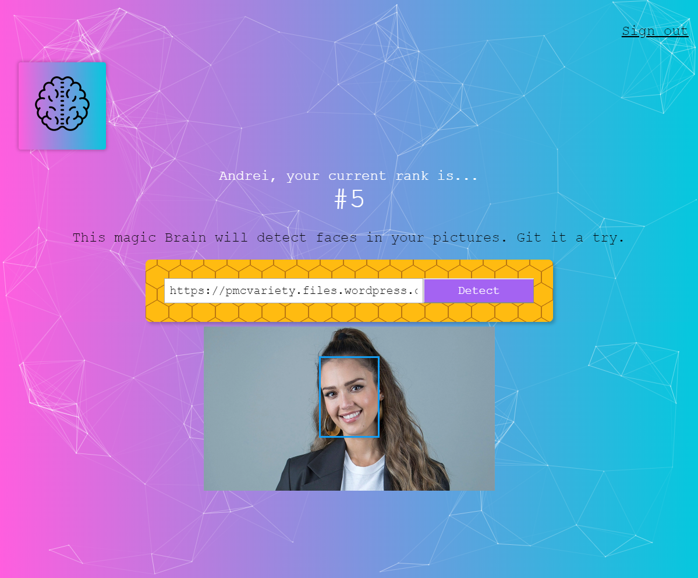

*In progress...*
React app with face recognition from the UDEMY course *The Complete Web Developer in 2019: Zero to Mastery* by Andrei Neagoie.

Built using:
* HTML,
* CSS,
* NPM,
* React,
* Tachyons,
* Clarifai API[:link:](https://www.clarifai.com/), 
* React Particles.js [:link:](https://www.npmjs.com/package/react-particles-js),
* Node.js,
* Express.js,
* SQL,
* PostgreSQL,
* Heroku.

### LIVE APP [:arrow_forward:](https://smart-brain-recognition-app.herokuapp.com/)

